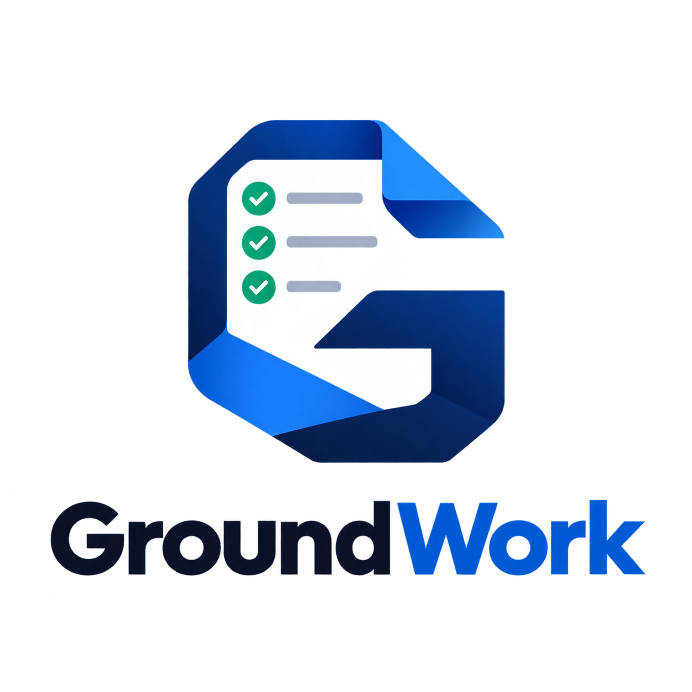

<p align="center">
  
</p>

<h3 align="center">Coding agents write code fast.<br>GroundWork makes sure it's the right code.</h3>

<p align="center">
  A free, open-source plugin for Claude Code that turns your AI agent from a fast improviser<br>
  into a teammate that plans first, asks before building, and leaves a paper trail.
</p>

---

## The problem

AI coding agents are incredibly fast, and they are just as fast at making a mess.

- **They build from a one-line request.** You get the wrong thing, delivered quickly.
- **Every session has its own opinion.** Two agents, two designs, one confused product.
- **The reasoning lives in a chat window.** Close it, and the "why" is gone forever.
- **Nobody knows who asked for what.** When something breaks in production, no one knows whom to call.
- **Docs are written once, then rot.** New teammates and new agents trust information that is no longer true.

An agent is a skilled craftsperson who never attended the design review. Nothing it needs is written down, so it guesses.

## What GroundWork does

GroundWork gives your agent the missing system: a shared, written plan that everyone follows.

> **Standardize the system. Preserve the craftsmanship.**

Before any code is written, the agent interviews you, drafts a short decision document, and waits for **your approval**. Only then does it plan, build in small steps, and hand over cleanly. It can't skip a step, and it can't approve its own work. The rules are enforced by the tool itself, not by asking the agent nicely.

```
 idea → interview → RFC → you approve → spec → you approve → plan → build → handover
```

## Why you'll like it

**You stay in charge.**
Nothing gets built until a human approves the plan. Unknowns are flagged instead of guessed, and if the plan changes midway, you decide, and the change is recorded.

**Fewer rework loops.**
The agent asks its questions up front, as clickable choices instead of walls of text. You catch a wrong assumption in minutes, not after a week of code.

**Work never gets lost.**
Close the laptop, switch teammates, or start a fresh session. GroundWork shows what's in flight and resumes exactly where work stopped, without asking the same questions twice.

**Always know who to call.**
For every feature and bug it records who requested it, who owns it, who built it, who deployed it, and who supports it. One command answers "whom do I call?" during an incident.

**Bugs get fixed properly.**
A bug is treated as a broken requirement. It has to be diagnosed and get a regression test before anyone touches the code.

**Docs that stay true.**
GroundWork notices when the code or architecture moves on and flags the documents that are now out of date.

**Answers you'll actually read.**
The agent is told to answer first, in plain words, and keep it short, without dropping the caveats, risks or next steps you need.

**Works with what you already have.**
Point it at an existing project and it reads the code, drafts the documents from facts, and only asks what the code can't tell it. Adopt it gradually, one repo at a time.

## Who it's for

| If you are... | You get... |
| --- | --- |
| **A developer** | Clear specs before you code, and easy pickup of a colleague's half-finished work. |
| **A tech lead** | Consistent structure across repos and agents, with decisions recorded and reasons attached. |
| **A product owner** | An agent that asks before it builds, and requirements you can read and approve. |
| **On-call / support** | One screen showing the owner, builder, deployer and support contact. |
| **A new joiner** | A project brief and handover packs instead of code archaeology. |

## Install and use

**You need:** [Claude Code](https://claude.com/claude-code), Python 3.10+ (`python3` or `python` on PATH) and git.

**1. Install the plugin.** GroundWork is listed in Anthropic's plugin directory. Open [Customize](https://claude.ai/customize/plugins) in claude.ai or the Claude desktop app, go to the **Plugins** tab, choose **Discover**, search for **groundwork-specflow** (listed "from Anthropic Directory") and select **Add**. (This is the Plugins page, not the Connectors directory, which won't list it.) Then, in Claude Code, sign in with the same claude.ai account (`/login`, Claude Code v2.1.273 or later). The plugin syncs in the background the next time you start Claude Code. When you see `Plugins changed. Run /reload-plugins to activate.`, run:

```
/reload-plugins
```

It shows up in `/plugin` as `groundwork-specflow@synced`. Directory sync needs a claude.ai sign-in, so it doesn't work if you use an API key or `ANTHROPIC_AUTH_TOKEN` instead.

Prefer to install from the command line, or don't use a claude.ai account? Install straight from this repository. Run the first command and wait for "Successfully added marketplace" before the second:

```
/plugin marketplace add Hemanthkaruturi/GroundWork
/plugin install groundwork-specflow@groundwork-specflow
```

Use one route or the other, not both. If both are present, Claude Code loads the copy from the marketplace and ignores the synced one.

**2. Set up your project.** Open Claude Code in your project (new or existing) and run:

```
/groundwork-specflow:bootstrap
```

GroundWork explains where it is, interviews you with clickable choices, and writes your project documents without inventing facts.

**3. Ask for what you want.** Describe a feature or a bug the way you normally would. The agent starts with questions, writes the RFC, and stops for your approval.

**4. Approve when you're happy.** Only you can do this, so the agent can't do it for you:

```
/groundwork-specflow:approve
```

That's it. Come back any time and ask it to resume.

**5. Keep it up to date.** New versions are released from time to time.

- **Installed from the directory:** nothing to do. New versions sync each time you start Claude Code, and you run `/reload-plugins` when it says `Plugins changed`.
- **Installed from this repository:** turn on automatic updates once: run `/plugin`, open **Marketplaces**, select `groundwork-specflow`, and choose **Enable auto-update**. Updates then install in the background when you start a session. To update by hand, run this in Claude Code:

```
/plugin marketplace update groundwork-specflow
```

Then run this in a terminal:

```
claude plugin update groundwork-specflow@groundwork-specflow
```

Restart Claude Code (or run `/reload-plugins`) to start using the new version. If it says you already have the latest version, there is nothing new to install yet.

### Using Devin instead

GroundWork also runs in [Devin](https://devin.ai) (Devin CLI and Devin Desktop), from this same repository. You need Python 3.10+ and git, as above.

**Let Devin install it.** Open Devin in your project and paste this prompt:

```
Install GroundWork into this project. From this project's root, run this as one command, exactly as written, and show me its full output:

( GW_TMP=$(mktemp -d) && git clone -q https://github.com/Hemanthkaruturi/GroundWork.git "$GW_TMP/GroundWork" && bash "$GW_TMP/GroundWork/setup/install.sh"; rc=$?; rm -rf "$GW_TMP"; exit $rc )

If it fails, stop there and don't try to install GroundWork another way. Otherwise tell me to start a new Devin session.
```

Devin runs [setup/install.sh](setup/install.sh), which puts GroundWork in your project's `.devin/` folder as Devin project skills and hooks rather than as a plugin. Commit that folder, and everyone who opens the project in Devin gets GroundWork. Commands have no prefix in this install: `/bootstrap`, `/approve`, `/bypass` and `/status`.

**To update an install made this way**, including one from the earlier bootstrap (before 0.1.7), paste the same prompt into Devin again. The script replaces its own files and keeps everything else, including your project documents and any hooks of your own. An earlier bootstrap install is converted to the new layout. Then check it:

1. Open `.devin/groundwork-version`. It shows the `version` and `commit` now installed. An install from before 0.1.7 has no `version` line.
2. Check that `.devin/skills/groundwork-specflow/` is gone. The earlier bootstrap put a copy of the plugin there. Each skill now has its own folder, such as `.devin/skills/approve/`.
3. Check that `.devin/config.json` no longer lists `.devin/skills/groundwork-specflow` under `requiredPlugins`.
4. Start a new Devin session, run `/hooks`, and look for the groundwork hooks (SessionStart, UserPromptSubmit, Stop, PreToolUse and PostToolUse running `.devin/groundwork/engine/groundwork.py`).
5. Run `/status`. It should report where the project stands.

Commit the changes in `.devin/` so your team gets the update too.

Because this doesn't use Devin's plugin system, it's meant to work when your company has turned Devin plugins off. That hasn't been confirmed on such a setup yet. If `/hooks` lists no groundwork hooks there, please open an issue.

**Or install it as a plugin**, for you in every project:

```
devin plugins install Hemanthkaruturi/GroundWork#plugins/groundwork-specflow
```

To install the plugin for one project instead, add it to `.devin/config.json` at the repository root. Devin installs it when the project is opened. This form, with the `#plugins/groundwork-specflow` path inside `requiredPlugins`, hasn't been tested in Devin yet.

```json
{
  "requiredPlugins": ["Hemanthkaruturi/GroundWork#plugins/groundwork-specflow"]
}
```

As a plugin, commands start with `/groundwork-specflow:`. To update, run `devin plugins update groundwork-specflow`. Use one install or the other, not both.

Either way, start a new session and run `/hooks` to check that the groundwork hooks are loaded. Then use it as described above: run bootstrap, then approve when you're happy.

What's different on Devin:

- **Questions come as numbered options in the reply** rather than clickable choices, because Devin has no picker tool.
- **Rules are enforced only in the Devin CLI and Devin Desktop.** Devin doesn't run plugin hooks in cloud sessions, so there GroundWork's skills guide the agent but nothing blocks a code edit.
- **Devin may skip a hook that fails.** It runs plugin hooks "best effort": if one fails to load or run, the session carries on without it. Add the git hook from `bootstrap` (or `groundwork.py hooks install`) so commits are checked either way.
- **Your company may have turned plugins off.** If Devin says CLI plugins are disabled by your organization, the plugin install won't load, whether for you, with `--local` or through `.devin/config.json`. Use the prompt above instead.

**Installed the plugin before it was renamed?** It used to be called `groundwork`. If updating fails with `Plugin "groundwork" not found`, run this once in Claude Code, then restart:

```
/plugin install groundwork-specflow@groundwork
```

Your project's `.groundwork/` records and documents keep working. Commands now start with `/groundwork-specflow:`.

---

<p align="center">Released under the <a href="LICENSE">MIT License</a>. <a href="PRIVACY.md">Privacy</a>.</p>
